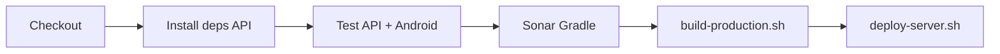

# Guía CI/CD — Happy Jump (Jenkins + scripts + SonarQube)

Modelo **híbrido**: una sola app de negocio, dos artefactos desplegables:

| Artefacto | Carpeta fuente | Salida del build | Deploy |
|-----------|----------------|------------------|--------|
| **API** | `server/` | `dist/happyjump-api.tar.gz` | `$HAPPYJUMP_DEPLOY_BASE/api/current` |
| **Cliente Android** | `app/` | `dist/happyjump-app-release.apk` | `$HAPPYJUMP_DEPLOY_BASE/app/current` |

Sin Tomcat, sin ngrok: **Jenkins → tests → Sonar → `ci/build-production.sh` → `ci/deploy-server.sh`**.

GitHub Actions (`api-tests.yml`, SonarCloud, Snyk) es CI en la nube; esta guía es el **laboratorio Jenkins on-premise**.

---

## 1. Configuración de Jenkins

### 1.1 Levantar stack (SonarQube + Jenkins)

```powershell
cd D:\apphappy\infra\docker
docker compose up -d
```

| Servicio | Puerto |
|----------|--------|
| SonarQube | http://localhost:9000 |
| Jenkins | http://localhost:8081 |

### 1.2 Plugins (incluidos en imagen `infra/jenkins`)

- Pipeline / workflow-aggregator  
- Git  
- SonarQube Scanner (`sonar`)  
- NodeJS (`nodejs`)  
- credentials-binding  
- docker-workflow  

Tras actualizar `plugins.txt`, reconstruir: `docker compose build jenkins && docker compose up -d jenkins`.

### 1.3 Tools (Manage Jenkins → Tools)

| Tool | Nombre en Jenkins | Uso |
|------|-------------------|-----|
| **NodeJS** | `NodeJS 22` | `npm ci` / `npm run test:ci` en `server/` |
| **Git** | (por defecto) | Checkout SCM |
| **SonarQube Scanner** | (vía plugin Sonar) | Etapa Sonar del `Jenkinsfile` |

Instalar Node 22 en la imagen Jenkins o marcar “Install automatically” en la sección NodeJS.

### 1.4 SonarQube server en Jenkins

**Manage Jenkins → System → SonarQube servers**

| Campo | Valor |
|-------|--------|
| Name | `sonarqube` (debe coincidir con `withSonarQubeEnv('sonarqube')`) |
| Server URL | `http://sonarqube:9000` (desde contenedor Jenkins) |

### 1.5 Credenciales (Manage Jenkins → Credentials → Global)

| ID | Tipo | Uso |
|----|------|-----|
| `github-token` | Secret / Username+Password | Solo si el job **no** usa “Pipeline from SCM” y clonas por URL |
| `sonar-token` | Secret text | Token de SonarQube local (`happyjump-local`) |
| `deploy-token` | Secret text | Opcional: exportar en el job como `DEPLOY_TOKEN` + `EXPECTED_DEPLOY_TOKEN` antes de `deploy-server.sh` |

Con **Pipeline script from SCM**, el checkout usa el remoto del job; `github-token` es opcional.

### 1.6 Job Pipeline

1. **New Item** → `happy-jump` → Pipeline  
2. **Pipeline script from SCM** → Git → repo → rama `main` o `develop`  
3. Script Path: `Jenkinsfile`  
4. Variable opcional del job: `HAPPYJUMP_DEPLOY_BASE` (ruta de deploy en el agente)

---

## 2. Flujo del pipeline



| Etapa | Acción |
|-------|--------|
| Checkout SCM | Código del repo |
| Install Dependencies | `npm ci` en `server/` |
| Test | `npm run test:ci` + Gradle unit tests + JaCoCo (Docker Android) |
| Sonar | `./gradlew sonar` + `sonar-project.local.properties` |
| Build | `./ci/build-production.sh` → `dist/` |
| Deploy | `./ci/deploy-server.sh` → `~/servers/happyjump/...` |

---

## 3. Scripts locales (sin Jenkins)

```powershell
cd D:\apphappy\server
npm install
npm run test:ci

cd D:\apphappy
# Requiere Git Bash o WSL para .sh:
bash ./ci/build-production.sh
bash ./ci/deploy-server.sh
```

O solo pruebas: `.\scripts\ci-local.ps1`

---

Prueba local paso a paso: [`JENKINS_PRUEBA_PASO_A_PASO.md`](JENKINS_PRUEBA_PASO_A_PASO.md)  
Script preflight: `scripts/jenkins-preflight.ps1`

## 4. Estructura tras el deploy

En Jenkins (Docker), los archivos se copian a **`deploy-runtime/`** en la raíz del repo.

En preflight local (Windows): `%USERPROFILE%\servers\happyjump\`

```
~/servers/happyjump/   (o deploy-runtime/ en el repo)
  api/current/          # API Node lista (npm ci ya aplicado si hay npm en el agente)
  api/releases/<build>/
  app/current/
    happyjump-app-release.apk
    build-info.json
  app/releases/
  rollback/
  logs/deploy.log
```

Levantar API en el servidor:

```bash
cd ~/servers/happyjump/api/current
# Crear .env con MySQL, JWT_SECRET, PORT
npm start
```

Health: `http://localhost:3000/health`

---

## 5. Equivalencia con la plantilla Angular

| Plantilla (Angular) | Happy Jump |
|---------------------|------------|
| `npm ci` en raíz | `npm ci` en `server/` |
| `npm run test:ci` | `npm run test:ci` en `server/` |
| `npx sonar-scanner` | `./gradlew sonar` (Kotlin + JaCoCo) |
| `dist/proyecto/browser` | `dist/happyjump-api.tar.gz` + `dist/happyjump-app-release.apk` |
| `deploy-server.sh` → `current/` HTML | Mismo patrón → `api/current` + `app/current` |

---

## 6. Evidencias para el curso

- Captura Jenkins: pipeline verde (todas las etapas).  
- Captura SonarQube :9000 — proyecto `happyjump-local`.  
- `dist/build-info.json` y `~/servers/happyjump/logs/deploy.log`.  
- `npm run test:ci` y Gradle test (log o JUnit en Jenkins).  
- Opcional: GitHub Actions + `docs/EVIDENCIAS_CALIDAD_SONAR_SNYK.md`.

---

*Happy Jump — CI/CD por scripts (API + APK)*
