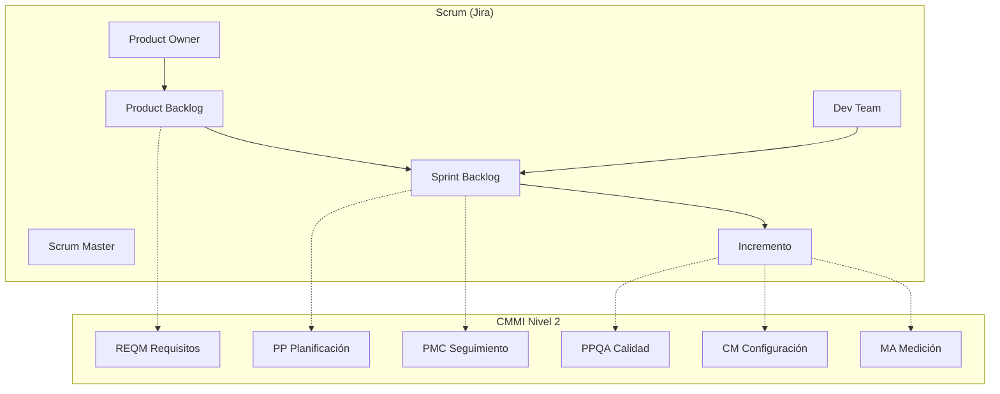

# Scrum + CMMI — Happy Jump

Documento para entregar al profesor: cómo el proyecto **Happy Jump** usa **Scrum** (gestión ágil en Jira) y alinea procesos con **CMMI** (mejora de procesos de software).

---

## 1. Resumen ejecutivo

| Marco | Rol en Happy Jump |
|-------|-------------------|
| **Scrum** | *Cómo* trabajamos día a día: sprints, backlog, tablero, reuniones. |
| **CMMI** | *Qué procesos* demostramos: planificación, requisitos, calidad, configuración, medición. |

**Nivel CMMI objetivo del proyecto:** **Nivel 2 — Managed (Gestionado)**  
Procesos documentados, planificados y medidos; Scrum es la implementación práctica.

---

## 2. Scrum en Happy Jump

### 2.1 Roles

| Rol Scrum | Quién (equipo típico) | Responsabilidad en Happy Jump |
|-----------|------------------------|-------------------------------|
| **Product Owner** | Tú / líder del equipo | Prioriza backlog: cancha, salones, reportes, calidad. |
| **Scrum Master** | Tú o compañero | Facilita sprints, quita bloqueos (MySQL, Docker, Jira). |
| **Development Team** | Desarrolladores | App Android + API Node + pruebas + CI. |

*Proyecto individual:* una persona cumple los tres roles; se documenta en Jira.

### 2.2 Artefactos

| Artefacto | Ubicación Happy Jump |
|-----------|----------------------|
| **Product Backlog** | Jira (épica + stories) + `docs/REQUERIMIENTOS.csv` |
| **Sprint Backlog** | Jira — sprint activo |
| **Incremento** | Código en GitHub + APK/API desplegable + docs |
| **Definition of Done** | Ver sección 2.5 |

### 2.3 Eventos (ceremonias)

| Ceremonia | Frecuencia | Evidencia sugerida |
|-----------|-----------|-------------------|
| **Sprint Planning** | Inicio de sprint (2 sem) | Acta 1 página + captura Jira sprint |
| **Daily Scrum** | 15 min / día (o 3×/sem en curso) | Bitácora corta en `docs/scrum/daily-log.md` |
| **Sprint Review** | Fin de sprint | Demo (app + Swagger) + captura |
| **Sprint Retrospective** | Tras review | `docs/scrum/retrospectiva-sprint-N.md` |
| **Backlog Refinement** | Mitad de sprint | Issues refinadas en Jira |

### 2.4 Sprints propuestos (3 × 2 semanas)

| Sprint | Objetivo | Entregable principal |
|--------|----------|----------------------|
| **Sprint 1** | Fundamentos | Login + API + cancha básica + MySQL |
| **Sprint 2** | Negocio completo | Salones + reportes + sesión única |
| **Sprint 3** | Calidad y cierre | k6, Swagger, Jenkins/Sonar, Jira, documentación |

### 2.5 Definition of Done (DoD)

Un ítem solo pasa a **Done** si:

- [ ] Código en `main` (o rama fusionada) con commit descriptivo
- [ ] API o pantalla probada manualmente
- [ ] Sin regresión en `npm run test:ci` (API) si aplica
- [ ] Documentación mínima actualizada (si cambió endpoint o flujo)
- [ ] Issue Jira en **Done** con comentario de cierre

---

## 3. CMMI — Nivel 2 y áreas de proceso

CMMI organiza **áreas de proceso (PA)**. En este proyecto demostramos las de **Nivel 2**:

### 3.1 Tabla Scrum ↔ CMMI

| PA CMMI (Nivel 2) | Nombre | Cómo lo cumple Happy Jump + Scrum |
|-------------------|--------|-----------------------------------|
| **REQM** | Gestión de requisitos | `REQUERIMIENTOS.csv`, matriz RF, stories en Jira, Swagger |
| **PP** | Planificación del proyecto | Sprints, Gantt (`CRONOGRAMA_GANTT*.md`), estimación en Jira |
| **PMC** | Seguimiento y control | Tablero Jira, burndown, daily, checklist entrega |
| **PPQA** | Aseguramiento de calidad del proceso | Plan de pruebas, Sonar/Snyk, revisión de PR/commits |
| **CM** | Gestión de configuración | Git, GitHub, tags, `.gitignore`, migraciones versionadas |
| **MA** | Medición y análisis | Velocity Jira, métricas k6, cobertura JaCoCo, Sonar |

### 3.2 Nivel 3 (opcional — si el profesor pide “más CMMI”)

| PA CMMI (Nivel 3) | Cómo enlazarlo |
|-------------------|----------------|
| **REQD** | Diseño derivado de requisitos → `openapi.json`, diagramas en docs |
| **VER** | Verificación → casos de prueba CP-xxx, tests automatizados |
| **VAL** | Validación → demo con usuario (trabajador/admin) en Sprint Review |

Indica en la entrega: *“Procesos definidos a Nivel 2; prácticas de Nivel 3 aplicadas en VER/VAL mediante plan de pruebas.”*

---

## 4. Jira: configuración Scrum + etiquetas CMMI

### 4.1 Tipo de proyecto

- Plantilla: **Scrum**
- Clave: **HJ**

### 4.2 Campos / etiquetas CMMI en cada issue

Crea etiquetas en Jira (Labels):

```
cmmi-reqm  cmmi-pp  cmmi-pmc  cmmi-ppqa  cmmi-cm  cmmi-ma
```

Al crear o editar una story, añade la etiqueta del PA correspondiente.

| Tipo de trabajo | Etiqueta CMMI |
|-----------------|---------------|
| Historia de usuario / requisito | `cmmi-reqm` |
| Planificación sprint / estimación | `cmmi-pp` |
| Seguimiento / daily / burndown | `cmmi-pmc` |
| Pruebas / Sonar / revisión | `cmmi-ppqa` |
| Git / release / migración | `cmmi-cm` |
| Métricas k6 / informes | `cmmi-ma` |

### 4.3 Importar backlog

Usa `docs/jira-import/happy-jump-backlog.csv` y el archivo ampliado:

`docs/jira-import/happy-jump-backlog-scrum-cmmi.csv`

---

## 5. Evidencias para el profesor (paquete de entrega)

| # | Evidencia Scrum | Evidencia CMMI |
|---|-----------------|----------------|
| 1 | Captura **Product Backlog** Jira | Matriz `REQUERIMIENTOS.csv` / RF |
| 2 | Captura **Sprint Board** con columnas | Planificación: Gantt o Sprint goal escrito |
| 3 | **Burndown** del sprint | PMC: seguimiento de avance |
| 4 | Acta **Sprint Planning** (PDF) | PP: alcance y fechas del sprint |
| 5 | **Daily** (3–5 entradas) | PMC: monitoreo diario |
| 6 | **Sprint Review** (demo + fotos) | VAL: validación con roles Admin/Trabajador |
| 7 | **Retrospectiva** (qué mejorar) | Mejora continua (OPF ligero) |
| 8 | Commits GitHub enlazados a HJ-XX | CM: control de versiones |
| 9 | Plan de pruebas + CP-xxx | PPQA + VER |
| 10 | Sonar / k6 / Swagger | PPQA + MA |

Guarda capturas en: **`docs/evidencias-scrum-cmmi/`**

---

## 6. Plantillas rápidas

### Sprint Planning (copiar en Word)

```
Proyecto: Happy Jump (HJ)
Sprint: ___  Duración: 2 semanas
Sprint Goal: _______________________________________________

Ítems comprometidos (Jira):
- HJ-___ 
- HJ-___

Capacidad / estimación: ___ story points
Riesgos: MySQL, Docker, tiempo de compilación Android
```

### Daily Scrum (una línea por día)

```
Fecha: ____  Sprint: ____
- Ayer: 
- Hoy: 
- Impedimentos: 
```

### Retrospectiva

```
Sprint: ____
- Qué salió bien:
- Qué mejorar:
- Acción concreta próximo sprint:
```

---

## 7. Diagrama integrado



---

## 8. Texto para carátula / informe (copiar)

> El proyecto Happy Jump se gestiona con **metodología Scrum** (backlog, sprints de dos semanas, ceremonias y tablero en Jira). Los procesos se alinean con **CMMI nivel 2 (Managed)** mediante gestión de requisitos (REQM), planificación y seguimiento (PP, PMC), aseguramiento de calidad (PPQA), gestión de configuración con Git (CM) y medición con pruebas k6 y SonarCloud (MA). Scrum proporciona el marco de ejecución; CMMI proporciona el marco de madurez y trazabilidad para la entrega académica.

---

## 9. Archivos relacionados en el repo

| Archivo | Contenido |
|---------|-----------|
| `docs/GUIA_JIRA_HAPPY_JUMP.md` | Jira paso a paso |
| `docs/jira-import/happy-jump-backlog-scrum-cmmi.csv` | Backlog con etiquetas CMMI |
| `docs/scrum/plantilla-sprint-planning.md` | Plantilla planning |
| `docs/scrum/plantilla-retrospectiva.md` | Plantilla retro |
| `docs/scrum/daily-log.md` | Bitácora daily |

---

## 10. Preguntas frecuentes del profesor

**¿Por qué Scrum y CMMI juntos?**  
Scrum no contradice CMMI: CMMI describe *qué procesos* deben existir; Scrum describe *cómo* iterar el desarrollo. Muchas empresas usan ágil + modelos de madurez para auditoría y mejora.

**¿Qué nivel CMMI declaramos?**  
**Nivel 2** con evidencias reales del repo. No afirmes Nivel 4–5 sin datos formales de organización.

**¿Cuántos sprints?**  
Mínimo **3** de 2 semanas (6 semanas) o adapta al calendario del curso (`CRONOGRAMA_GANTTIO_HAPPY_JUMP.md`).
